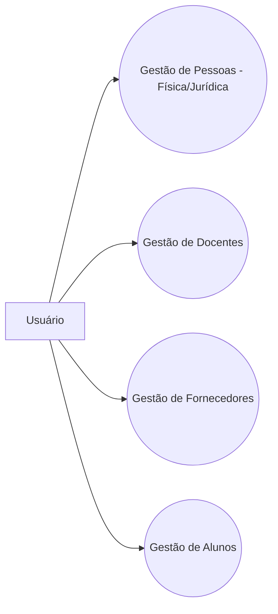

```mermaid
flowchart LR
  %% Ator
  A[Usuário]


  %% Casos de uso (nós circulares)
  UC1((Gestão de Pessoas - Física/Jurídica))
  UC2((Gestão de Docentes))
  UC3((Gestão de Fornecedores))
  UC4((Gestão de Alunos))

  %% Ligações - Usuário
  A --> UC1
  A --> UC2
  A --> UC3
  A --> UC4

```
