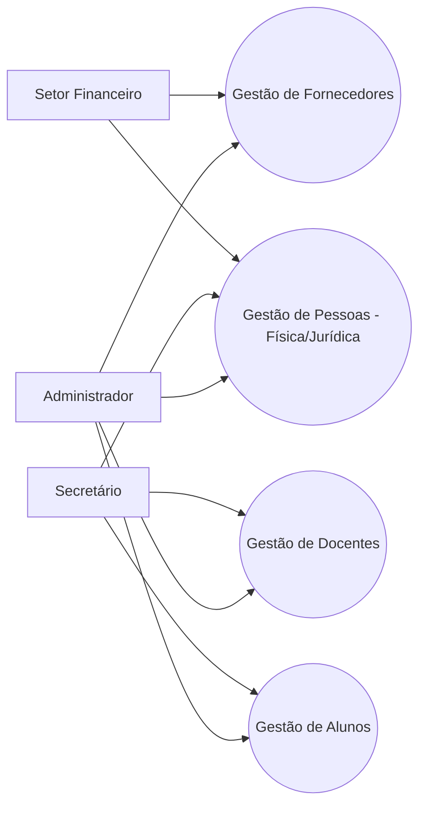

```mermaid
flowchart LR
  %% Atores
  A[Administrador]
  S[Secretário]
  F[Setor Financeiro]

  %% Casos de uso (nós circulares)
  UC1((Gestão de Pessoas - Física/Jurídica))
  UC2((Gestão de Docentes))
  UC3((Gestão de Fornecedores))
  UC4((Gestão de Alunos))

  %% Ligações - Administrador
  A --> UC1
  A --> UC2
  A --> UC3
  A --> UC4

  %% Ligações - Secretário
  S --> UC1
  S --> UC2
  S --> UC4

  %% Ligações - Financeiro
  F --> UC3
  F --> UC1
```
